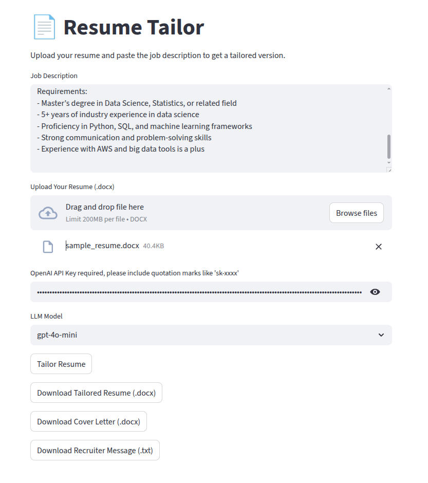
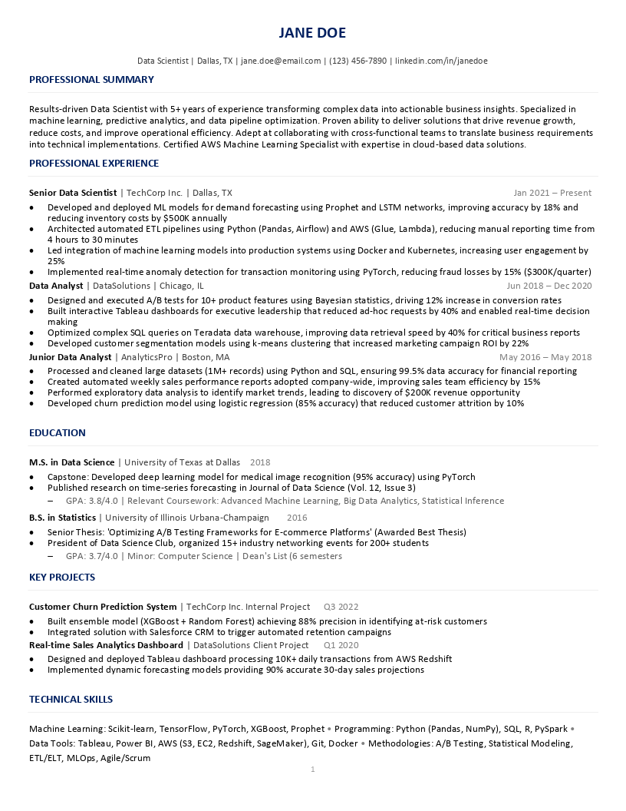
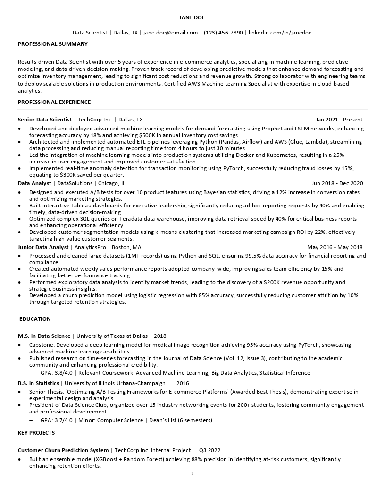

# Dreamloom Resume Tailor✨
**LLM-Powered Resume Tailoring Agent --- TailoringWithout Losing Format**

## Why the Name *Dreamloom*?

The name **Dreamloom** draws on the imagery of weaving dreams into fabric.  
Just as a loom interlaces threads with precision, this project weaves tailored language into your resume while preserving its original format — fonts, bold/italic styles, tables, and the preferred one-page layout.  

But *Dreamloom* is more than a tool. The **dream** represents your aspirations and the career path you hope to shape. The **loom** symbolizes the craft of turning those aspirations into reality.  

Together, *Dreamloom* captures a simple idea:  
✨ **By tailoring your resume, you are weaving the fabric of your own future.**


## 🚀 What makes this LLM Resume Tailor Spceial?
While there are many similar projects online, Dreamloom Resume is the only AI assistant that tailors your resume to a job description while **keeping the original document formatting intact**.  
Unlike existing tools (e.g., Simplify, ChatGPT add-ons) that break layouts, extend resumes beyond one page, or lose styling — **Dreamloom preserves fonts, bold, italics, tables, and bullet styles** while rewriting content to match the job.


## 🚀 Why Dreamloom Resume?
- **Format-Preserving:** Reinserts tailored text back into the original `.docx` file.
- **ATS-Optimized:** Uses recruiter-friendly fonts & structure.
- **Smart Tailoring:** Expands relevant experiences, rewrites irrelevant lines, integrates job-specific keywords.
- **Time Saver:** Upload resume + job description → download a ready-to-send tailored resume.
- **Flexible Usage:** Use via **CLI** or **Streamlit Web UI**.


## 📸 Demo




### Examples

| Original Resume | Tailored Resume |
|--|--|
|  |  |


## 🛠 Features
- 📝 Tailors line-by-line with LLM guidance
- 🎯 Emphasizes impact with job-relevant skills & metrics
- 🎨 Preserves original fonts, bold/italic, tables, bullets
- ⏱ Keeps resume concise and one-page friendly
- 🔑 Supports both **CLI usage** and **Streamlit web app**


## 📦 Installation
Clone the repository and install dependencies:
```bash
git clone https://github.com/jizhou3721/Dreamloom.git
cd Dreamloom
pip install -r requirements.txt
```


## ▶️ Usage


### Streamlit Web App

For a no-code experience, launch the web interface:

```bash
streamlit run src/app.py
```

Open [http://localhost:8501](http://localhost:8501) in your browser.
You’ll be able to:

* Upload your resume (`.docx`)
* Paste or upload a job description
* Download the tailored resume (format preserved ✅)


## ⚙️ Configuration

* **API Provider**: Currently supports [OpenAI](https://platform.openai.com/) (GPT-4 family).
* **Environment variables** (set before running):

  ```bash
  export USE_OPENAI=1
  export OPENAI_API_KEY="your_api_key_here"
  export OPENAI_MODEL="gpt-4o-mini"
  ```
* **One-page enforcement**: By default, resumes are trimmed/optimized to remain within one page (configurable in `tailor_resume.py`).


## 📂 Project Structure

```bash
resume-tailor-app/
├── src/
│   ├── tailor_resume.py      # Core tailoring + formatting logic
│   └── app.py                # Streamlit web UI
│
├── examples/
│   ├── sample_resume.docx    # Example input resume
│   ├── sample_jd.txt         # Example job description
│   └── output_resume.docx    # Example tailored result
│
├── requirements.txt          # Dependencies
├── README.md                 # Documentation
├── LICENSE                   # Open-source license (MIT)
└── CONTRIBUTING.md           # Contribution guidelines
```


## 🧪 Roadmap

* [ ] Add support for **PDF resumes**
* [ ] Multi-language resume support (EN, CN, etc.)
* [ ] Additional LLM providers (Anthropic, Gemini)
* [ ] Smarter **one-page enforcement**
* [ ] Cloud-hosted demo (Streamlit Cloud / HuggingFace Spaces)


## 📜 License

This project is licensed under the AGPL-3 License — see the [LICENSE](LICENSE) file for details.


## 🤝 Contributing

Contributions are welcome!

1. Fork this repo
2. Create a feature branch (`git checkout -b feature/new-idea`)
3. Commit your changes (`git commit -m "Add new feature"`)
4. Push to your fork and submit a PR

See [CONTRIBUTING.md](CONTRIBUTING.md) for more.


## 🙌 Contacts

jingzhou9981@gmail.com

```


